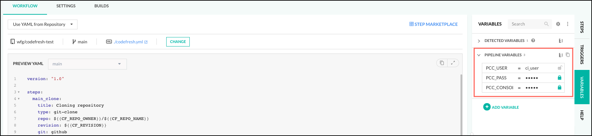
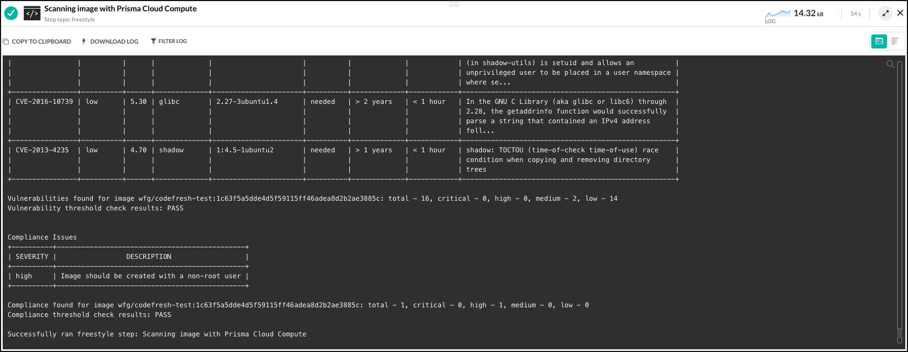
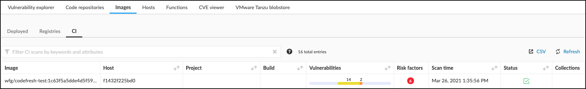

This directory contains an example of a basic [Codefresh pipeline](https://codefresh.io/docs/docs/configure-ci-cd-pipeline/introduction-to-codefresh-pipelines/) that integrates container image scanning for vulnerabilities and compliance issues directly into Codefresh.

This example only builds an image using the Dockerfile at the repository's root and scans the resultant image.
The intent is to demonstrate how `twistcli` may fit into your Codefresh pipeline.

## Requirements
To use this Codefresh pipeline, you will need
* a functional Prisma Cloud Compute Console that is reachable from the Codefresh build environment
* credentials for a Compute user ([CI User](https://docs.twistlock.com/docs/compute_edition/authentication/user_roles.html#ci-user) or [Build and Deploy Security](https://docs.twistlock.com/docs/enterprise_edition/authentication/prisma_cloud_user_roles.html#prisma-cloud-roles-to-compute-roles-mapping) role is recommended)

## Setup
1. Create the variables used by the pipeline (`PCC_USER`, `PCC_PASS`, and `PCC_CONSOLE_URL`).
You can do this either at the pipeline or project level.

    If you are using Prisma Cloud Compute Edition (self-hosted), `PCC_USER` and `PCC_PASS` will likely just be your normal username and password of the user with CI User role.
    `PCC_CONSOLE_URL` will be the address you use to access the Compute Console.

    If you are using Prisma Cloud Enterprise Edition (SaaS), `PCC_USER` and `PCC_PASS` will be your [access key and secret key](https://docs.twistlock.com/docs/enterprise_edition/authentication/access_keys.html#provisioning-access-keys) pair created with the Build and Deploy Security role.
    `PCC_CONSOLE_URL` will be the address found at **Compute > Manage > System > Downloads** under the **Path to Console** heading.

    

2. Add the `codefresh.yml` file to the root of your repository.

    

Codefresh uses a [volume shared between all the steps in a pipeline](https://codefresh.io/docs/docs/configure-ci-cd-pipeline/introduction-to-codefresh-pipelines/#sharing-the-workspace-between-build-steps) as the pipeline's workspace.
This allows you to use a separate image to pull the `twistcli` tool to the workspace to be used by the final image, removing the requirement for the final image to have a way to pull the tool itself.

The final image will be built, tagged, and scanned using `owner/repository:commit`.
This is the image name under which the scan results will be displayed in the Compute Console.
You can adjust this with the `image_name` and `tag` arguments to the `build_image` step in `codefresh.yml`.
If you change `tag`, you should also change it at the end of the scan step where the image name is provided.

Here is a sample of the output in Codefresh:


... and the corresponding output in the Compute Console:


The image scan policy (including failure thresholds) is managed in the Compute Console at
* **Defend > Vulnerabilities > Images > CI**
* **Defend > Compliance > Containers and images > CI**

If you are using a self-signed certificate on the Compute Console, you may have to add `--no-check-certificate` to the `wget` command.
For example:

```wget --header "Authorization: Basic $(echo -n $PCC_USER:$PCC_PASS | base64 | tr -d '\n')" --no-check-certificate $PCC_CONSOLE_URL/api/v1/util/twistcli```
