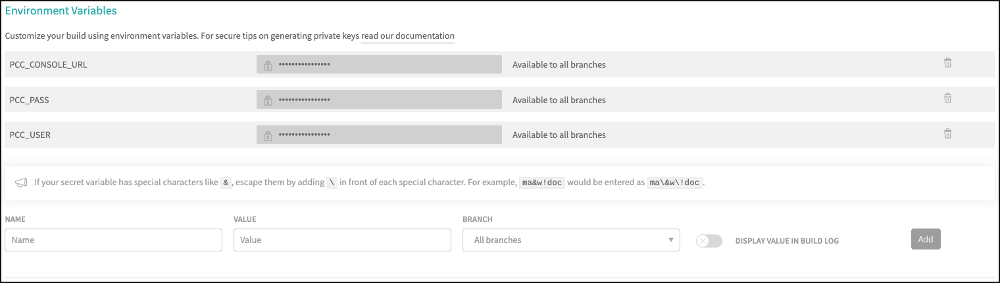
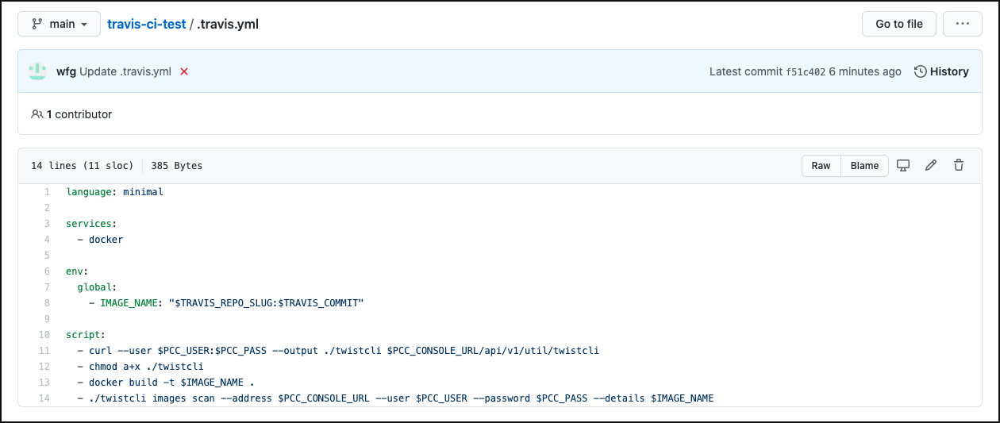
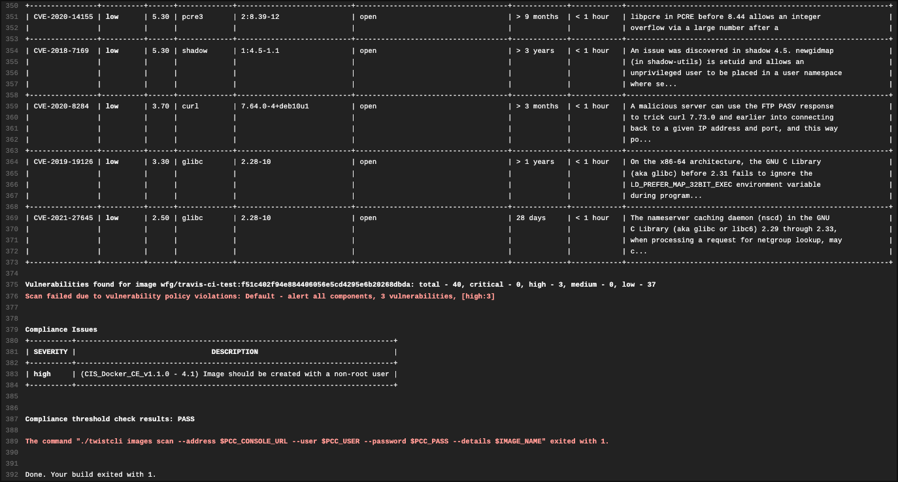
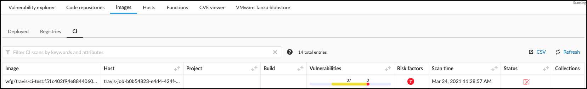

This directory contains an example of a basic [Travis CI build config](https://docs.travis-ci.com/user/tutorial/) that integrates container image scanning for vulnerabilities and compliance issues directly into Travis CI.

This example only builds an image using the Dockerfile at the repository's root and scans the resultant image.
The intent is to demonstrate how `twistcli` may fit into your Travis CI build config.

## Requirements
To use this Travis CI build config, you will need
* a functional Prisma Cloud Compute Console that is reachable from the Travis CI build environment
* credentials for a Compute user ([CI User](https://docs.twistlock.com/docs/compute_edition/authentication/user_roles.html#ci-user) or [Build and Deploy Security](https://docs.twistlock.com/docs/enterprise_edition/authentication/prisma_cloud_user_roles.html#prisma-cloud-roles-to-compute-roles-mapping) role is recommended)

## Setup
1. Create the variables used by the build config (`PCC_USER`, `PCC_PASS`, and `PCC_CONSOLE_URL`).
See [Travis CI's documentation](https://docs.travis-ci.com/user/environment-variables/#defining-variables-in-repository-settings) for instructions on how to create these.

    If you are using Prisma Cloud Compute Edition (self-hosted), `PCC_USER` and `PCC_PASS` will likely just be your normal username and password of the user with CI User role.
    `PCC_CONSOLE_URL` will be the address you use to access the Compute Console.

    If you are using Prisma Cloud Enterprise Edition (SaaS), `PCC_USER` and `PCC_PASS` will be your [access key and secret key](https://docs.twistlock.com/docs/enterprise_edition/authentication/access_keys.html#provisioning-access-keys) pair created with the Build and Deploy Security role.
    `PCC_CONSOLE_URL` will be the address found at **Compute > Manage > System > Downloads** under the **Path to Console** heading.

    

2. Add the `.travis.yml` file to the root of your repository.

    

The image will be built, tagged, and scanned using `owner/repository:commit`.
This is the image name under which the scan results will be displayed in the Compute Console.
You can adjust this with the `IMAGE_NAME` variable in `.travis.yml`.

Here is a sample of the output in Travis CI:


... and the corresponding output in the Compute Console:


The image scan policy (including failure thresholds) is managed in the Compute Console at
* **Defend > Vulnerabilities > Images > CI**
* **Defend > Compliance > Containers and images > CI**

If you are using a self-signed certificate on the Compute Console, you may have to add `--insecure` to the `curl` command.
For example:

```curl --user $PCC_USER:$PCC_PASS --output ./twistcli --insecure $PCC_CONSOLE_URL/api/v1/util/twistcli```
